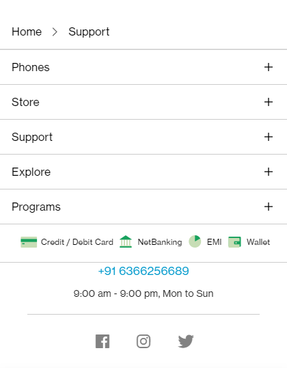
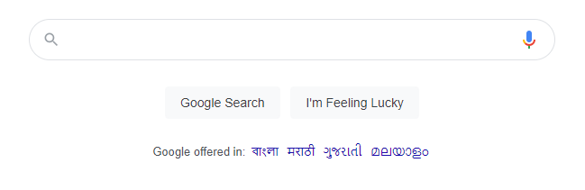
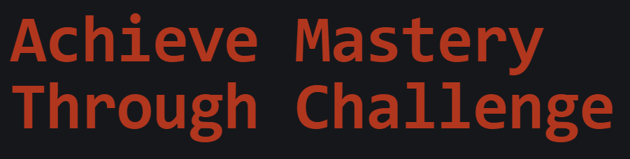
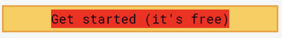
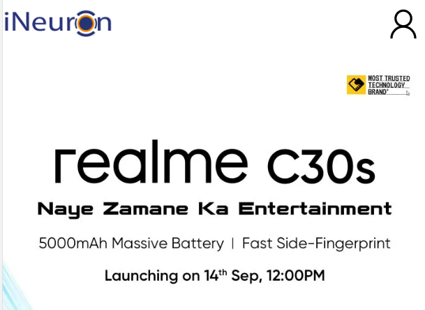
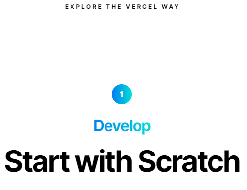
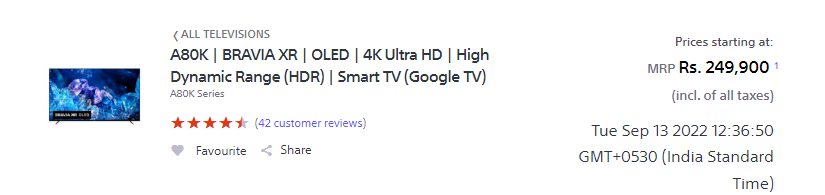

# Dom Manipulation Assignment

1. Webiste Name: [Dev To](https://dev.to/)

### Topics

    - Query Selctory, Inner HTML

### Sample Image


### Tasks

     Target the Top description div and change the DEV Community to <Your_Name> and description to your passion

### Output


### Ans:

```
document.querySelector('.crayons-subtitle-2').innerHTML = "Pranav"

document.querySelector('.color-base-70').innerHTML = "I write code"
```

2. Website Name: [Apple](https://support.apple.com/en-in)

### Task


### Fetch all the product name and store in an array

### Output

['iPhone', 'Mac', 'iPad', 'Watch', 'AirPods', 'Music', 'TV']

### Ans:

```
const List = document.querySelectorAll(".as-imagegrid-item-title");
let list = []
List.forEach(ele => {
    let val = ele.innerText.replace("\nSupport","");
    list.push(val)
})

console.log(list)
```

3. Webiste Name: [Youtube Support](https://support.google.com/youtube/)

### Topics

    - Get Element By Id, Create Element, Create Text Node, Append Child

### Sample Image


### Tasks

     Add another FAQ 'My New FAQ' to the list

### Output


### Ans:

```
const accordian = document.querySelector('.accordion-homepage')

const createSection = document.createElement("section")
createSection.className = "parent"

const createAnotherTag = document.createElement("h3")

const textNode = document.createTextNode("My NEW FAQ");

createAnotherTag.appendChild(textNode)

createSection.appendChild(createAnotherTag)

accordian.appendChild(createSection)
```

4. Webiste Name: [OnePlus](https://www.oneplus.in/support)

### Topics

     Query Selector, InnerText

### Sample Image


### Tasks

      Change the contact number

### Output



### Ans:

```
document.querySelectorAll('.item--subtitle').innerHTML = "Solve Your Errors on your Own"
```

5. Webiste Name: [Samsung](https://www.samsung.com/in/offer/online/samsung-fest/)

### Topics

       getElementById, createElement, InnerText, append, setAttribute

### Sample Image


### Tasks

     Target the main div of card and change the Button text to Check out

### Output


### Ans:

```
document.querySelectorAll(".diwali-deals-product-sale-btn").innerText="Check Out";
```

6. Webiste Name: [Adidas](https://www.adidas.co.in/)

### Topics

    -   Query Selector, Event listeners, Changing Styles

### Sample Image


### Tasks

     Target the search box and on hover change thebackground color to red.

### Output


### Ans:

```

  const searchbox = document.querySelector(".searchinput___19uW0")
  searchbox.addEventListener("onmouseover", hoverover)

  function hoverover(){
  searchbox.style.backgroundColor = "red"
  };

```

7. Webiste Name: [MDN Web Docs](https://developer.mozilla.org/en-US/)

### Topics

       Form, Value, Submit

### Sample Image


### Tasks

     To Search a topic in the MDN Search bar.
     First add a text to search in the search bar and then hit the submit search button to search the docs using DOM

### Output


### Ans:

```

document.querySelector('#hp-search-input').value = "CSS"
document.querySelector('.search-input-field').value="CSS"
document.querySelector('.search-form').submit()

```

8. Webiste Name: [Google](https://www.google.com/)

### Topics

       Remove Elements

### Sample Image


### Tasks

     Remove alternate languages from the home page languages listed

### Output



### Ans:

```
let lang = document.querySelectorAll('.z4hgWe a')

lang.forEach((ele,idx)=>{
     if(idx % 2 == 0) {
          ele.remove()
     }
})
```

9. Webiste Name: [Code Wars](https://www.codewars.com/)

### Topics

       Change Font Family, Color of Text.

### Sample Image


### Tasks

    Change the font family of the text to monospace and text color to the logo’s background color.

### Output



### Ans:

```
document.querySelector('.text-color-white').style.color = "Red";
```

10. Webiste Name: [Freecodecamp](https://www.freecodecamp.org/)

### Topics

       querySelector, mouseover, click eventListener,  callback function, style,

### Sample Image


### Tasks

    Target the button and change background colour on mouseover

### Output



## Ans :

```
     let el = document.querySelector(".btn-cta-big .login-btn-text")

     handleOver = () => {
     el.style.backgroundColor = "Red"
     }

     handleOut = () => {
     el.style.removeProperty('background')
     }

     el.addEventListener('mouseover', handleOver)
     el.addEventListener('mouseout', handleOut)

```

11. Webiste Name: [realme](https://www.realme.com/in/)

### Topics

       querySelector,style,background-image

### Sample Image


### Tasks

    change the realme logo to ineuron logo

### Output



### Ans :

```
  var x = document.getElementById("myImg")
  x.src = "https://ineuron.ai/images/ineuronimg/-logo.png" ;
```

12. Webiste Name: [Github](https://github.com/)

### Topics

       querySelector,style,background-Color

### Sample Image


### Tasks

     change the background colour of the button to blue.

### Output


### Ans :

```
     let el = document.querySelector(".js-repo-form .btn")
     el.style.backgroundColor = "Blue"
```

13. Webiste Name: [Hackerrank](https://www.hackerrank.com/)

### Topics

       querySelector,innerHtml

### Sample Image


### Tasks

Target the top description and change “Matching developers with great companies” to ‘JSBOOTCAMP“.

### Output


### Ans:

```
document.querySelector('.home22-intro-title').innerHTML = "JavaScript Rank"
```

14. Webiste Name: [Asus](https://www.asus.com/in/)

### Topics

      querySelector,style,font-size

### Sample Image


### Tasks

       change the fontsize of “Hot Deals” to 80px

### Output


### Ans:

```
let el = document.querySelector('.HotDealsAll__Heading__2fIbe')
el.style.fontSize = "80px"

```

15. Webiste Name: [Dell](https://www.dell.com/en-in/shop/deals/laptop-deals?gacd=10415953-9016-5761040-285981356-0&dgc=ST&gclid=Cj0KCQjwguGYBhDRARIsAHgRm4-XUDMhhVNyHXb3s1gY4ZBzORr_d9Se-buhJwy7asyUe7YdqEA11eEaAt6UEALw_wcB&gclsrc=aw.ds&nclid=BxjBlpBQsX6pjSHh-L8YYSU77EpfXRkG1AGMB5Wbeu386ykspfrPDnfx_DdFau20)

### Topics

      querySelector,style.textAlign

### Sample Image


### Tasks

       Convert the text “G15 Gaming Laptop” from left to right

### Output


### Ans:

```
     let el = document.querySelector(".ps-title a");
     el.style.textAlign = "right";
```

16. Webiste Name: [Vercel](https://vercel.com/)

### Topics

     querySelector,innerHTMl

### Sample Image


### Tasks

      change the heading “Start with the developer” to “Start with Scratch”

### Output



### Ans:

```
document.querySelector(".section-title_title__VEDfK").innerText = "I Invented This"

```

17. Webiste Name: [Sony](https://www.sony.co.in/)

### Topics

    querySelector,innerHTMl

### Sample Image


### Tasks

     change the button text To current Date.

### Output



### Ans:

```
     let el = document.querySelector('.btn-container .buy-button')

     today = new Date();
     let dd = today.getDate();
     let mm = today.getMonth()+1;
     var yyyy = today.getFullYear();

     if(dd<10) {dd='0'+dd;}
     if(mm<10) {mm='0'+mm;}

     myDate = mm+" - "+dd+" - "+yyyy;

     el.innerText = myDate;
```

18. Webiste Name: [Philips](https://www.philips.co.in/)

### Topics

     querySelector,style,backgroundcolor

### Sample Image


### Tasks

    change the background colour blue to orange

### Output


### Ans:

```
document.querySelector('.p-f03-footer-container .p-footer').style.backgroundColor = "Orange"
```

19. Webiste Name: [Canon](https://in.canon/)

### Topics

          querySelector,src

### Sample Image


### Tasks

    extract the canon logo

### Output


### Ans :

```
  let el = document.querySelector('.logo')
  el.src;

```

20. Webiste Name: [Oppo](https://www.oppo.com/in/)

### Topics

          querySelector,style,color

### Sample Image


### Tasks

      Change the description colour black to orange

### Output


### Ans:

```
document.querySelector('.desc').style.color = "Orange";
```
